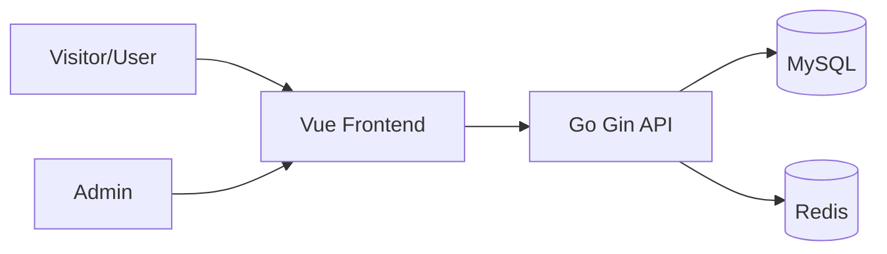

# System Overview (v1)

## 目标
描述登录注册与首页骨架阶段的系统边界、主流程、权限边界、错误分类。

## 上下文边界
- Frontend: 登录、注册、首页骨架渲染。
- Backend: 注册、审批、登录、会话签发。
- MySQL: 用户与审批状态持久化。
- Redis: 会话与短期状态缓存。

## 主流程（最小）

## 权限模型（初版）
- Guest: 可访问登录/注册页。
- Pending User: 已注册待审批，不可登录业务首页。
- Approved User: 可登录并访问首页。
- Admin: 唯一管理员，可审批用户。

## 错误模型（初版）
- `VALIDATION_ERROR`: 参数不合法。
- `UNAUTHORIZED`: 凭据错误或未登录。
- `FORBIDDEN_PENDING_APPROVAL`: 用户待审批。
- `FORBIDDEN_ADMIN_ONLY`: 非管理员调用审批接口。
- `NOT_FOUND`: 用户不存在。
- `INTERNAL_ERROR`: 未预期异常。
